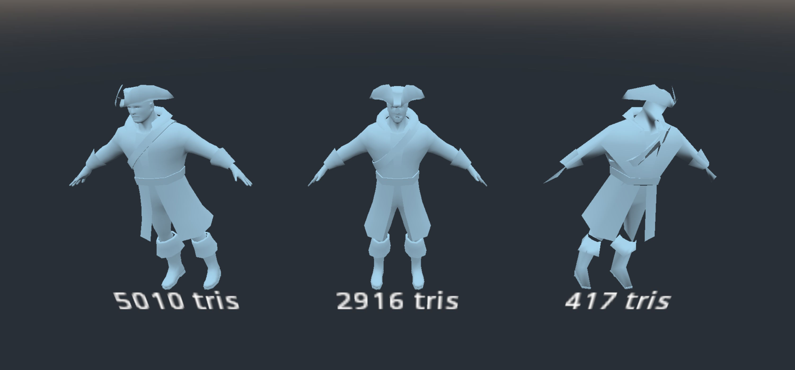

# gd3-meshopt
Simple GDNative bridge to the [MeshOptimizer](https://github.com/zeux/meshoptimizer) library using [meshopt-rs](https://github.com/gwihlidal/meshopt-rs).
Using this library, LODs for `ArrayMesh`es can be built at runtime for procedurally generated or user-supplied geometry, e. g. voxel-based terrain. Additionally, the mesh is indexed, optimized for gpu vertex cache fetches and overdraw.

In Godot 4, the [MeshImporter](https://docs.godotengine.org/en/stable/classes/class_importermesh.html) can be used instead of this library.



## Usage

Example lives [here](godot/scenes/Game.gd).

```
var testmesh: MeshInstance = get_node("TestMesh")
var testmesh_lod0: MeshInstance = get_node("TestMesh_Lod0")
var testmesh_lod1: MeshInstance = get_node("TestMesh_Lod1")
	
var arrays: Array = testmesh.mesh.surface_get_arrays(0)
var input := {
	"vertex_positions": arrays[Mesh.ARRAY_VERTEX], # PoolVector3Array
	"vertex_normals": arrays[Mesh.ARRAY_NORMAL], # PoolVector3Array
	"vertex_coords": PoolVector2Array(), # PoolVector2Array
	"indices": arrays[Mesh.ARRAY_INDEX], # PoolIntArray
	"lods": PoolIntArray() # PoolIntArray
}

# Generate two lods with a target of 5000, 250 indices and 0.1 %, 2 % error targets
var result = meshOptimizer.simplify(input, PoolIntArray([5000, 250]), PoolRealArray([0.001, 0.02]))

# Result is a dictionary containing vertex_positions, vertex_normals, vertex_coords as above
# result["lods"] is a PoolIntArray array with length 2 with start index of the respective requested lods 
# result["indices"] contains the PoolIntArray index buffer of all lods - first the optimized original mesh, then the lods at the specified offsets 
```

## Setup
To build, please read the instructions of the [rust template wiki](https://github.com/macalimlim/godot-rust-template/wiki) for setup.

If you only want to use the library, you can copy over the [prebuilt gdnative library and gdnative script](godot/native).

## Run example
```shell
$ cargo make run
```

## Acknowledgment

- Uses [godot-rust-template](https://github.com/macalimlim/godot-rust-template/) (MIT-licensed)
- Uses [godot-rust/gdnative](https://github.com/godot-rust/gdnative) (MIT-licensed)
- Uses [meshopt-rs](https://github.com/gwihlidal/meshopt-rs) (MIT-licensed)
- Example model is Pirate by Clint Bellanger, https://opengameart.org/content/pirate, distributed under CC-BY-SA 3.0